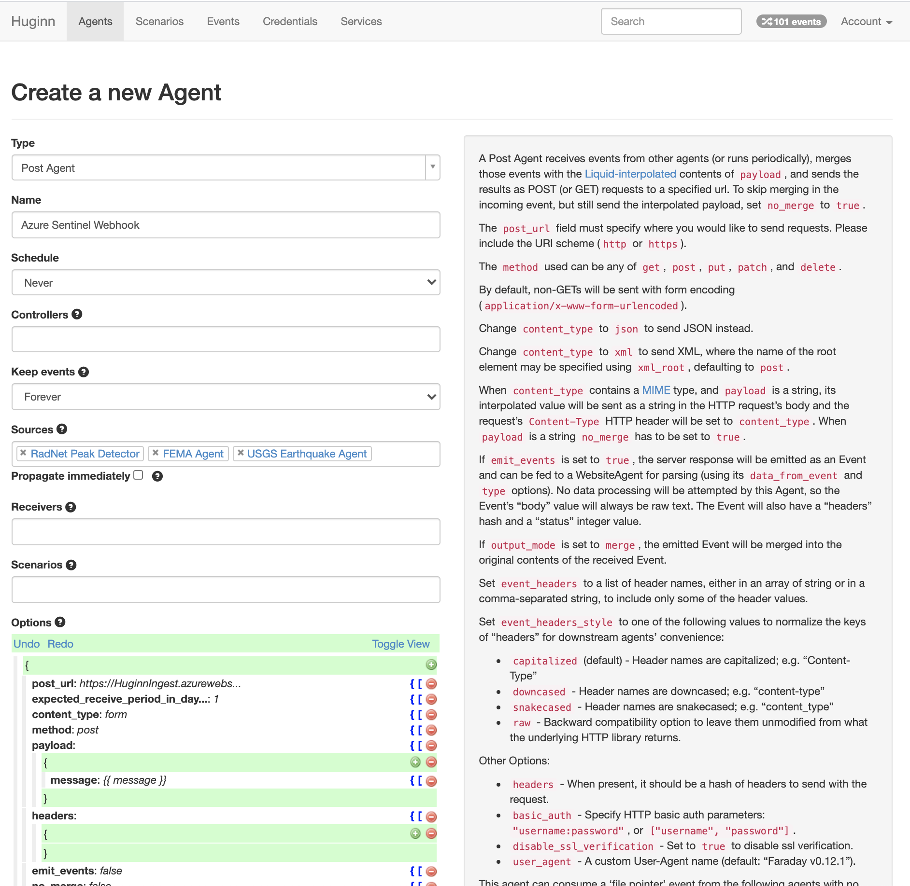

# Deploy a Function App for sending Huginn webhooks into Azure Sentinel

This function app will listen for Huginn webhooks and write them to Log Analytics.

### Deploy the Function App

1.  Deploy the template.

Right click to open in a new window. You'll need your Workspace ID and Workspace Key. See [these instructions on how to find them](https://docs.microsoft.com/en-us/azure/azure-monitor/platform/agent-windows#obtain-workspace-id-and-key).

2. Deploy permissions for the function to the Key Vault.

## Configure your Huginn installation

Setup a Huginn Post Agent to send events to your new Function App. The URL should be in the format of `https://FunctionAppName.azurewebsites.net/api/Huginn`. Find this URL in the [Azure Function App Portal](https://portal.azure.com/#blade/HubsExtension/BrowseResource/resourceType/Microsoft.Web%2Fsites/kind/functionapp).

---

This DataConnector is based on https://github.com/Azure/Azure-Sentinel/tree/master/DataConnectors/OneLogin